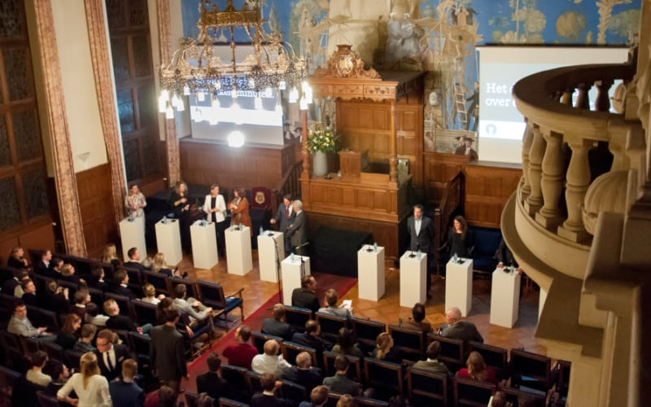

+++
date = '2017-04-01T09:06:02+01:00'
draft = false
title = 'QuickTick'
description = 'Flexibel ticketsysteem voor Groninger verkiezingsdebat Tweede Kamer'
+++

Tijdens de landelijke verkiezingen van 2017 organiseerde mijn partij [Letteren Vooruit](../letteren-vooruit/) samen met Lijst STERK en faculteitsvereniging EBF een debat specifiek gericht op Groningen. Aan het debat deden onder andere Henk Nijboer (PvdA), Arno Rutte (VVD), en Thierry Baudet (FvD) mee. De belangstelling was daardoor erg groot. De capaciteit in de aula van de Rijksuniversiteit Groningen is met 300 man echter beperkt. Om alles in goede banen te leiden, moesten er tickets uitgegeven worden.

## Ticketmaster is geen optie

Als student kun je echter niet aankloppen bij Ticketmaster, en andere oplossingen als Eventbrite hebben hoge transactiekosten. Daarom bouwde ik samen met [Stijn Eikelboom](https://www.stijneikelboom.nl) in één nacht een nieuw systeem voor ticketuitgifte en -controle: _QuickTick_.

Ik verzorgde het ontwerp van de e-tickets; Stijn schreef in Python de benodigde code om de tickets op naam te kunnen zetten en van een unieke barcode te voorzien. Samen bouwden wij applicaties voor Android en het web voor het scannen van de tickets. Daarnaast bouwden we een API om de ticketdata te ontsluiten en bij te houden welke tickets al waren gebruikt. Dit alles werd draaiende gehouden door een Raspberry Pi, een computer met weinig rekenkracht.

## Een succesvolle avond
QuickTick hield goed stand tijdens deze volledig uitverkochte avond. Zonder noemenswaardige problemen kwamen alle 300 gasten binnen. De grootste uitdaging bleek het scannen van de tickets met het beperkte licht in de ontvangsthal. Gelukkig hadden de apps ook een handmatige invoeroptie voor deze gevallen.

_De debaters warmen op voor het Groninger Tweede Kamer Verkiezingsdebat (2017)_

Het debat zelf was ook een groot succes: de zaal zat vol met politiek geïnteresseerde studenten en genodigden. De vraag naar kaarten was uiteindelijk een stuk groter dan de 300 beschikbare plekken. Zelfs op TicketSwap werd gezocht naar kaarten, ongekend voor een politiek evenement georganiseerd door studenten.
