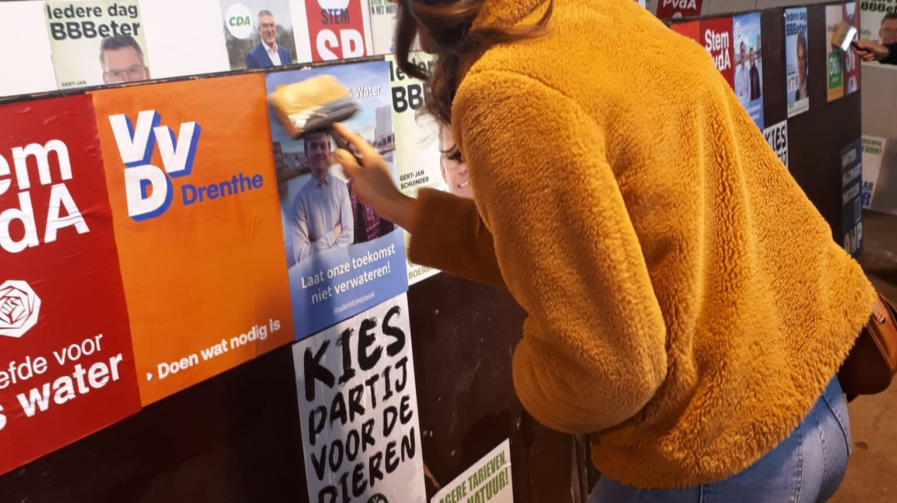
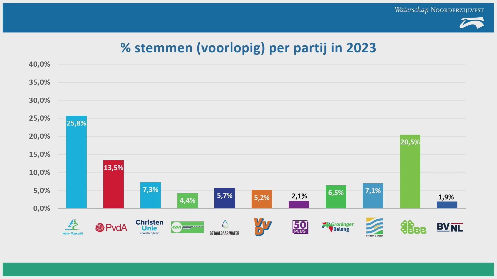

+++
date = '2023-03-17T17:00:00+01:00'
draft = false
title = 'Student & Water'
description = 'Studenten een stem geven in het waterschap Noorderzijlvest'
[params]
    technologies = ['PHP', 'WordPress']
    skills = ['Grafisch design', 'Marketing']
    duration = '2023 - heden'
+++

Een studentenpartij in het waterschap. Het begon als een lollig idee in een studentenkroeg. Maar studenten hebben best veel belang bij goed waterbeheer. Zwemplekken zonder blauwalg. Ruimte voor watersporten zoals roeien en zeilen. Een klimaatbestendige toekomst.

Op de kroegavond waar het idee ontstond, kreeg ik een appje van de initiatiefnemers. Ze vroegen me om mijn ervaring in de (studenten)politiek en grafisch design in te zetten voor deze kersverse partij. Daarmee begon een wilde rit van drie maanden om op het stembiljet en in het waterschapsbestuur te komen.

## Een goede lijst

Dankzij onze goede contacten in de Groningse studentenwereld wisten we snel een lijst van 37 kandidaten samen te stellen. Daarnaast moesten er 30 ondersteuningsverklaringen worden getekend door kiezers in het waterschap om mee te mogen doen. Voor dit hele proces verzorgde ik de registratie. Kandidaatgegevens verzamelde ik via Google Forms en importeerde ik in de OSV-software van de Kiesraad. Vervolgens werd voor elke kandidaat een bundel formulieren aangeboden via Adobe Sign om online te ondertekenen. Dankzij dit papierloze proces was het mogelijk om binnen een week alle benodigde stukken aan te leveren.

_Posters plakken op de vroege zaterdagochtend_

## De campagne breekt los

We hadden deelname aan de verkiezingen veiliggesteld. Maar niemand in Noorderzijlvest kende onze jonge partij nog. Tijd voor een stevige campagne. Zonder budget maar in samenwerking met de immer creatieve Lennard Pierey wisten we snel een campagnestrategie vorm te geven.

Mijn inbreng was met name het campagnemateriaal: posters, stickers, en het verkiezingsprogramma redigeren en opmaken. Daarnaast bouwde ik in een rap tempo een website om ons vindbaar te maken voor geïnteresseerde kiezers. Van ouderwets posters plakken op de gemeentewerf tot stickerend op kroegentocht: niets was ons te gek om het waterschap en onze partij onder de aandacht van studenten te brengen.

_De verkiezingsuitslag: één zetel voor Student & Water._

## 12.204 stemmen

Op 16 maart 2023 kregen we in het Waterschapshuis het verlossende woord. Student & Water mocht rekenen op maar liefst 12.204 stemmen, goed voor één zetel in het waterschap. De eerste jongerenpartij in de Nederlandse waterschappen was een feit. Na de verkiezingen mocht Student & Water aanschuiven bij de formatie van het nieuwe dagelijks bestuur. Samen met Water Natuurlijk, PvdA, Geborgde zetels Natuur en de combinatie Geborgd Ongebouwd – CDA – VVD is de partij nu onderdeel van de bestuurscoalitie.
